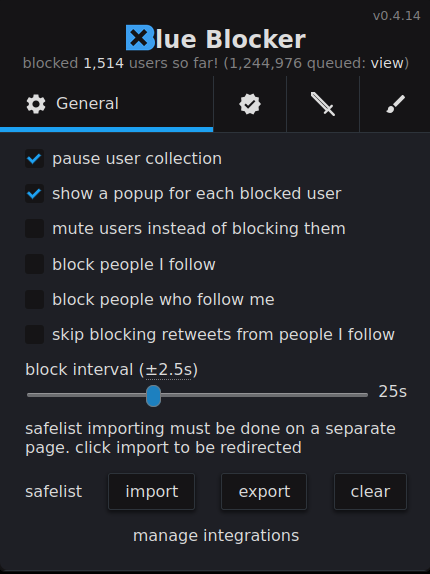
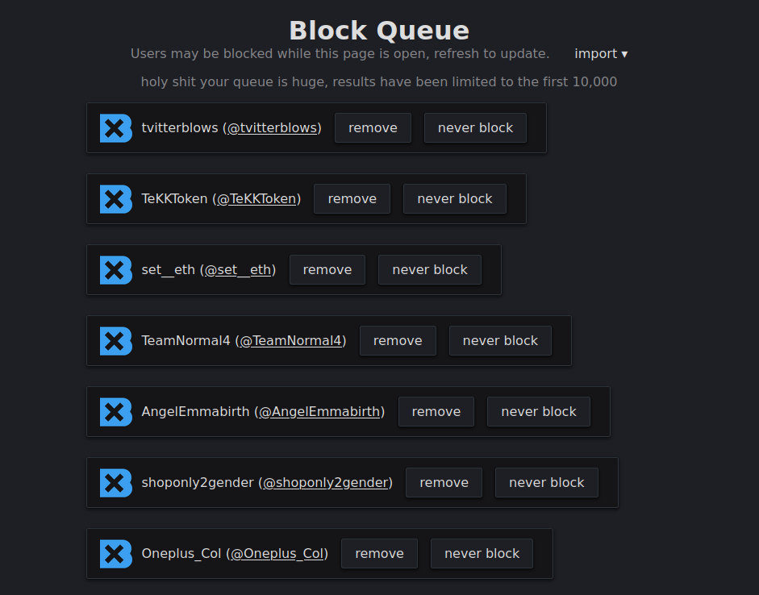
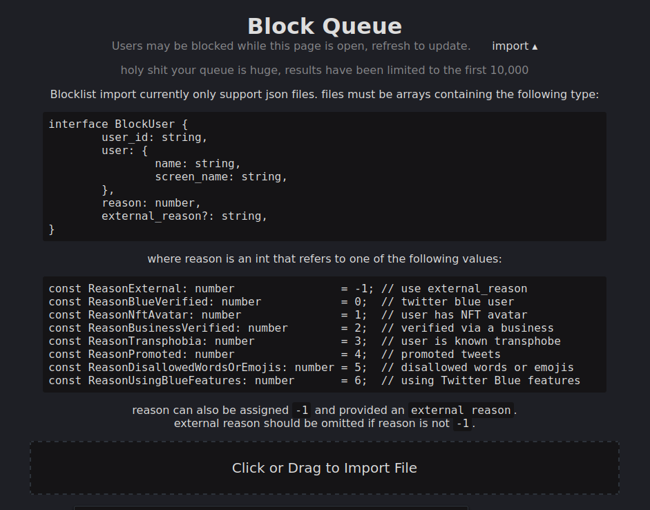

# Lists for Twitter Blue Blocker
The JSON lists in this repository were created for the [Blue Blocker Extension](https://github.com/kheina-com/Blue-Blocker), utilizing the pre-existing CSV lists from travisbrown's [blue](https://github.com/travisbrown/blue) and esqueer's [twitter_blue_blocklist](https://github.com/esqueer/twitter_blue_blocklist). 
### **There are other 5 JSON lists that can be found in bkh55's [BlueBlockerJsonReadyBlockList](https://github.com/bkh555/BlueBlockerJsonReadyBlockList). PLEASE CHECK IT OUT !!!**

The algorithm I made can be downloaded and used: 
```shell
# Clone the repository
$ git clone https://github.com/Ohnto-IT/Lists-for-Twitter-Blue-Blocker.git

# Change directory to the cloned repository
$ cd Lists-for-Twitter-Blue-Blocker/Code

# Run the program
$ ./csv_to_json /path/to/your/csvfile.csv USERID_COLUMN SCREENNAME_COLUMN
```
###### Please note that the CSV file should have columns referring to ``User_ID`` and ``Screenname`` (or ``Name``). The column names can vary, but their purpose must remain the same.
## Installing Blue Blocker
Blue Blocker is a free browser extension that automatically blocks all undesired Twitter Blue verified users that are appearing on your screen.
It's available for [Google Chrome](https://chrome.google.com/webstore/detail/blue-blocker/jgpjphkbfjhlbajmmcoknjjppoamhpmm),
[Mozilla Firefox](https://addons.mozilla.org/en-US/firefox/addon/blue-blocker/) and [Microsoft Edge](https://microsoftedge.microsoft.com/addons/detail/blue-blocker/hicoljclclooehbejnglkgohmclmipip).

## Importing the Lists

| Step 1: Open Blue Blocker and click on "View" in the top-right corner | Step 2: Click on "Import" in the top-right corner | Step 3: At the bottom, click or drag to import a file |
| -------- | ------- | ------- |
|   |    |   |

### Although many of these accounts no longer exist or aren't subscribed to Twitter Blue anymore, these lists will certainly help filter out far-right "individuals".

## License
The license contained in this repository applies only to the files inside the [/code](https://github.com/Ohnto-IT/Lists-for-Twitter-Blue-Blocker/tree/main/Code) folder.
